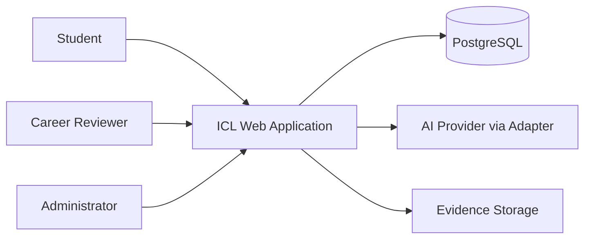
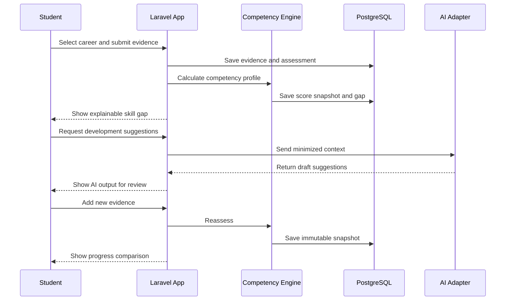

# ICL ITATS Architecture

## 1. Architecture Context

ICL ITATS is an MVP web application for a small student team, an initial population below 1,000 users, and a short competition timeline. It has meaningful rules around competency scoring, evidence, and reassessment but no proven need for independent service scaling or real-time collaboration.

## 2. Architectural Decision

Use a modular monolith:

- PHP and Laravel application;
- PostgreSQL system of record;
- server-rendered or lightweight web UI;
- synchronous HTTP for core workflows;
- isolated AI adapter for optional assistance;
- background jobs only for slow AI or file tasks.

Microservices, event sourcing, and CQRS are deferred until actual needs justify them.

## 3. System Context



## 4. Module Boundaries

```text
app/
  Http/
    Controllers/
    Middleware/
    Requests/
  Models/
  Services/
  Traits/
  Jobs/
```

- Identity: authentication, roles, profile, authorization.
- Career: career profiles, publication state, versions, metadata.
- Competency: competencies, mappings, required levels, priorities, evidence examples.
- Assessment: definitions, items, attempts, answers, result snapshots.
- Evidence: metadata, file/link references, status, reviewer notes.
- GapAnalysis: scoring rules, current level, gap, priority, explanation.
- DevelopmentPlan: activities, goals, expected evidence, deadlines, reflection.
- Reassessment: immutable snapshots, comparisons, deltas, recalculation triggers.
- Review: evidence review, comments, feedback.
- AiSupport: provider adapter, prompts, output validation, audit metadata, fallback.

## 5. Runtime Flow



## 6. Application Conventions

- Controllers coordinate HTTP concerns only.
- Form Requests validate input.
- Policies enforce authorization.
- Services contain multi-step domain operations.
- Models represent persistence and relationships.
- Scoring logic lives in a dedicated versioned service.
- Snapshot writes use transactions.
- AI calls are optional and never block core scoring.
- User-visible errors are safe and actionable; raw exceptions are logged only.

## 7. Web Boundary

The MVP may use Laravel web routes and server-rendered views. JSON endpoints are added only when interactive screens need them.

```text
/login
/dashboard
/profile
/careers
/competencies
/assessment
/evidence
/skill-gaps
/development-plans
/reassessments
/review
/admin
```

Every mutation requires CSRF protection, validation, authorization, and an audit-friendly response.

## 8. Security Architecture

- Hash passwords using Laravel's supported hashing.
- Enforce authorization on the server for every private resource.
- Store file references safely; do not expose private storage paths.
- Validate file type, size, and ownership.
- Escape rendered user content.
- Rate-limit login and AI endpoints.
- Keep provider keys in environment configuration.
- Minimize data sent to AI providers.
- Log security events without secrets or raw sensitive content.

## 9. Architecture Decision Records

### ADR-001: Modular Monolith

- Status: Accepted.
- Context: Small team, MVP timeline, cohesive product flow, and no proven independent scaling need.
- Decision: Use one Laravel application with explicit domain modules.
- Trade-off: Less independent scaling, but much lower deployment and coordination complexity.
- Revisit trigger: Independent scaling needs, team growth, or a proven production boundary.

### ADR-002: PostgreSQL System of Record

- Status: Accepted.
- Context: Relational entities, snapshot history, permissions, and explainable joins are central.
- Decision: Use PostgreSQL.
- Trade-off: Requires relational modeling, but gives strong integrity and queryability.

### ADR-003: Server-Authoritative Scoring

- Status: Accepted.
- Context: Score and gap outputs must be consistent and explainable.
- Decision: Calculate scores on the server and persist the rule version with every snapshot.
- Trade-off: Less client-side experimentation, but reliable and auditable results.

### ADR-004: AI as Adapter, Not Authority

- Status: Accepted.
- Context: AI helps with language tasks but may be inaccurate or unavailable.
- Decision: Isolate provider calls behind an adapter; AI output is reviewable and never authoritative.
- Trade-off: Requires fallback UI and review state, but protects the core workflow.

### ADR-005: Synchronous Core Workflow

- Status: Accepted.
- Context: Core operations are request/response and do not require real-time collaboration.
- Decision: Use synchronous operations for auth, assessment, scoring, and reassessment; use jobs only for slow optional tasks.
- Trade-off: Future workloads may need queues, but the MVP stays easier to debug.

## 10. Deployment Shape

```text
Browser -> HTTPS -> Web Server -> Laravel App -> PostgreSQL
                                      |
                                      +-> Private Evidence Storage
                                      +-> Optional AI Provider
```

The demo deployment must have a stable URL, seeded demo accounts, migrations, backup instructions, and a rollback path.
