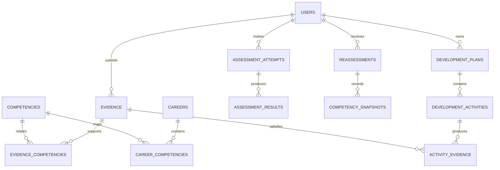

# ICL ITATS Database Architecture

## 1. Goals

- Preserve the relationship between career, competency, evidence, score, gap, activity, and reassessment.
- Keep assessment and reassessment snapshots auditable.
- Support PostgreSQL and Laravel migrations.
- Keep the MVP relational and easy to query.

## 2. Modeling Principles

1. Choose one primary key strategy consistently: UUID or big integer.
2. Use foreign keys for required relationships.
3. Use timestamps on mutable records.
4. Store rule versions with score results.
5. Store AI output as non-authoritative generated content.
6. Do not store secrets, raw passwords, or unnecessary sensitive data.
7. Treat reassessment snapshots as append-only.

## 3. Entity Relationship Overview

## 4. Core Tables

### 4.1 users

`id UUID PK`, `name varchar`, `email varchar UNIQUE`, `password varchar hashed`, `role varchar`, `program varchar nullable`, `semester smallint nullable`, `bio text nullable`, `created_at`, `updated_at`.

Roles: `student`, `reviewer`, `admin`.

### 4.2 careers

`id UUID PK`, `name varchar`, `slug varchar UNIQUE`, `description text`, `status varchar`, `version integer`, `source_notes text`, `created_by UUID FK users`, timestamps.

Statuses: `draft`, `published`, `archived`.

### 4.3 competencies

`id UUID PK`, `name varchar`, `slug varchar UNIQUE`, `description text`, `domain varchar`, timestamps.

### 4.4 career_competencies

`id UUID PK`, `career_id UUID FK`, `competency_id UUID FK`, `required_level numeric`, `priority varchar`, `weight numeric`, `rule_version varchar`, `source_notes text`, timestamps.

Unique constraint: `(career_id, competency_id, rule_version)`.

### 4.5 evidence

`id UUID PK`, `user_id UUID FK`, `title varchar`, `type varchar`, `description text`, `source_url varchar nullable`, `storage_key varchar nullable`, `obtained_at date nullable`, `validation_status varchar`, `reviewer_id UUID nullable`, `reviewer_note text nullable`, timestamps.

Types: `project`, `portfolio`, `test`, `certificate`, `reflection`, `other`.

Statuses: `draft`, `pending`, `verified`, `needs_revision`.

At least one of `source_url` or `storage_key` is required for evidence types that need a proof artifact.

### 4.6 evidence_competencies

`evidence_id UUID FK`, `competency_id UUID FK`, `relevance numeric 0..1`, `note text nullable`.

Primary key: `(evidence_id, competency_id)`.

### 4.7 assessments

`id UUID PK`, `career_id UUID FK`, `title varchar`, `version varchar`, `status varchar`, timestamps.

### 4.8 assessment_items

`id UUID PK`, `assessment_id UUID FK`, `competency_id UUID FK`, `prompt text`, `item_type varchar`, `max_score numeric`, `position integer`.

### 4.9 assessment_attempts

`id UUID PK`, `user_id UUID FK`, `assessment_id UUID FK`, `career_id UUID FK`, `status varchar`, `submitted_at timestamp nullable`, `created_at`.

### 4.10 assessment_results

`id UUID PK`, `attempt_id UUID FK`, `competency_id UUID FK`, `score numeric`, `max_score numeric`, `explanation text nullable`.

### 4.11 development_plans

`id UUID PK`, `user_id UUID FK`, `career_id UUID FK`, `status varchar`, timestamps.

Statuses: `active`, `paused`, `completed`, `archived`.

### 4.12 development_activities

`id UUID PK`, `plan_id UUID FK`, `competency_id UUID FK`, `title varchar`, `description text`, `expected_evidence text`, `priority varchar`, `status varchar`, `target_date date nullable`, `completed_at timestamp nullable`, `reflection text nullable`.

Statuses: `not_started`, `in_progress`, `blocked`, `completed`.

### 4.13 reassessments

`id UUID PK`, `user_id UUID FK`, `career_id UUID FK`, `previous_id UUID nullable self-FK`, `rule_version varchar`, `status varchar`, `created_at`, `completed_at nullable`.

### 4.14 competency_snapshots

`id UUID PK`, `reassessment_id UUID FK`, `competency_id UUID FK`, `required_level numeric`, `current_level numeric`, `gap numeric`, `status varchar`, `evidence_summary text`, `explanation text`.

Snapshots are append-only. Recalculation creates a new reassessment and new snapshots.

### 4.15 feedback

`id UUID PK`, `reviewer_id UUID FK`, `student_id UUID FK`, `evidence_id UUID nullable`, `competency_id UUID nullable`, `body text`, `created_at`.

### 4.16 ai_generations

`id UUID PK`, `user_id UUID nullable`, `purpose varchar`, `input_reference jsonb`, `output_text text`, `provider varchar`, `model varchar nullable`, `status varchar`, `created_at`.

Statuses: `generated`, `accepted`, `edited`, `rejected`, `failed`.

## 5. Indexes

- `users(email)` unique.
- `careers(slug, status)`.
- `career_competencies(career_id, competency_id)`.
- `evidence(user_id, validation_status)`.
- `evidence_competencies(competency_id)`.
- `assessment_attempts(user_id, career_id, status)`.
- `development_plans(user_id, status)`.
- `development_activities(plan_id, status, target_date)`.
- `reassessments(user_id, career_id, created_at desc)`.
- `competency_snapshots(reassessment_id, competency_id)`.

## 6. Transaction Boundaries

Use a transaction when:

1. Submitting an assessment and creating its results.
2. Completing a reassessment and writing all competency snapshots.
3. Publishing a career version with its competency mappings.
4. Completing an activity and attaching required evidence metadata.

## 7. Migration Order

1. Users and roles.
2. Careers and competencies.
3. Career mappings and evidence examples.
4. Assessments and items.
5. Evidence and evidence mappings.
6. Attempts and results.
7. Development plans and activities.
8. Reassessments and snapshots.
9. Feedback and AI generations.

## 8. Seed Data

Seed data must include one admin, one reviewer, one student, one published career, at least four competencies, one assessment, evidence examples, development activities, and sample completed/pending reassessments.

Seed data must be labeled as demo data and must never be presented as survey results.
